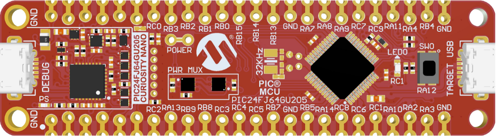
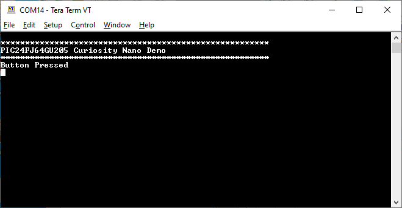

 

## PIC24FJ64GU205 Curiosity Nano Development Board Out-of-the-Box Demo

## Summary

LED on the board fades while the application is not 
connected to the USB port.

When connected, the board will print a "Button Pressed" message
on a serial terminal whenever the button is pressed.

## Related Documentation
https://microchip.com/PIC24FJ64GU205

## Software Used 
* A terminal program

## Hardware Used
* PIC24FJ64GU205 Curiosity Nano Development Board - https://www.microchip.com/EV10K72A
* Micro-USB cable (2 cables if programming/debugging)

## Setup

For programming/debugging the board, connect a micro-USB cable
to the USB connector labeled "DEBUG".  

For running the demo, connect a micro-USB to the USB connector 
labeled "TARGET USB".  

There is no other hardware setup required.

## Operation

If the board is powered but not connected through the "TARGET 
USB" connector, then the LED on the board will fade on and
off.  

If the board is connected through the "TARGET USB" port to a PC
and the drivers have loaded successfully, the LED will be solid
lit.  

When connected, open a terminal program and press the push
button on the board.  This will print a message on the terminal
screen.

Select the COM port that appeared when the board was connected
to the "TARGET USB" port.  This will be unique on each
computer.  The port settings do not matter (the baud
rate, parity, etc.).

